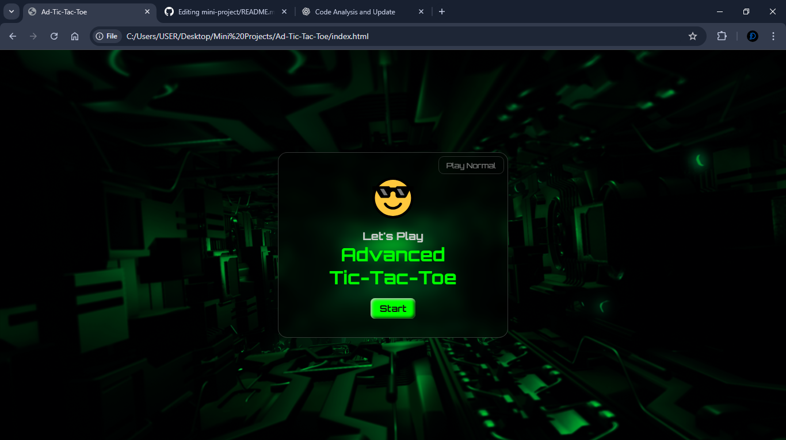
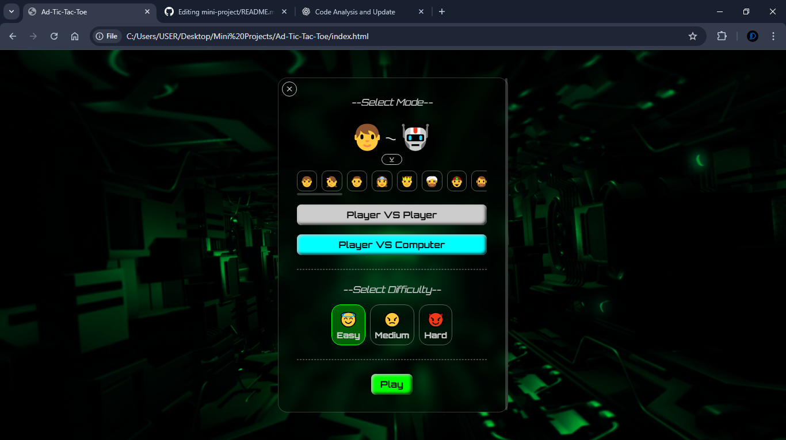
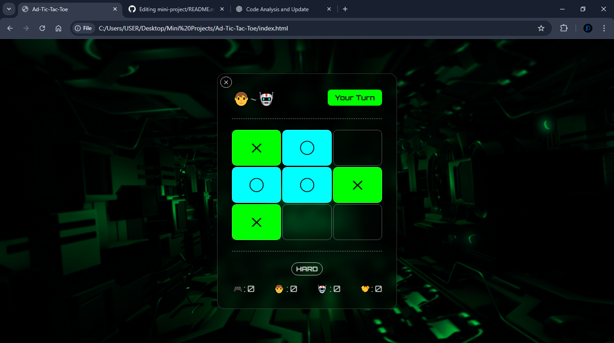
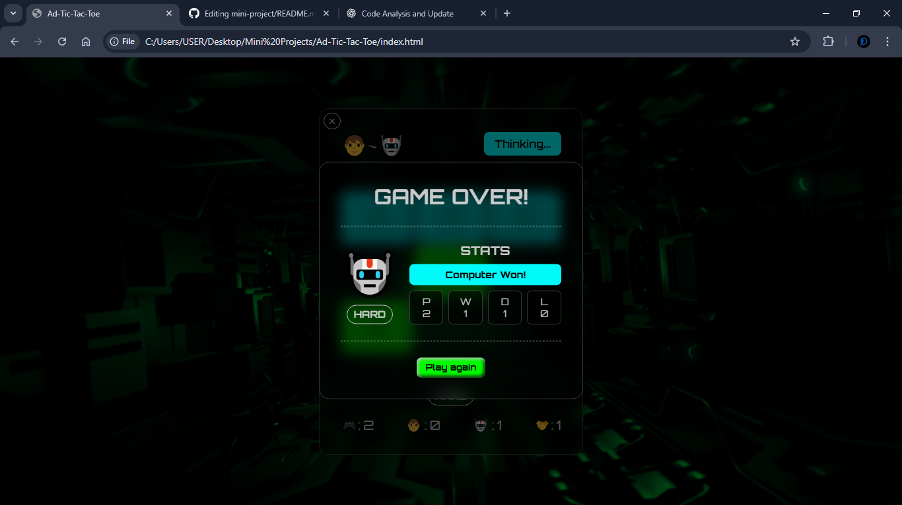
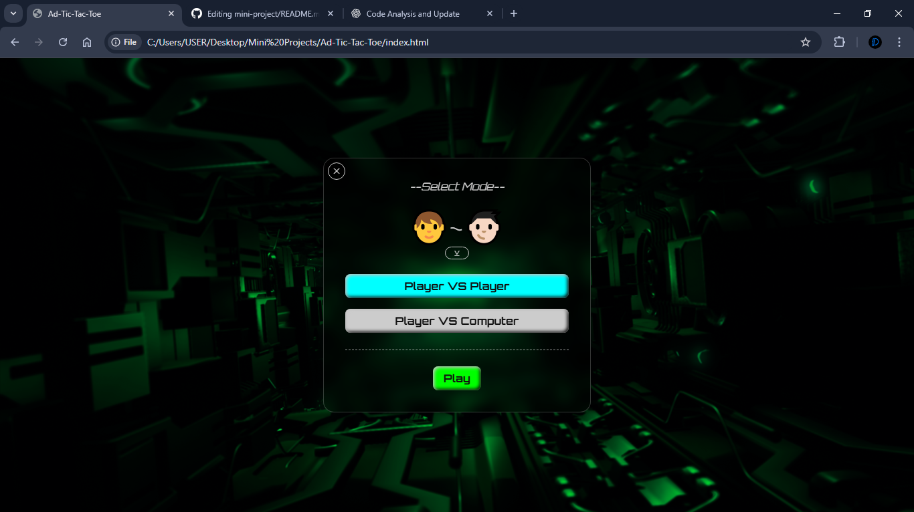
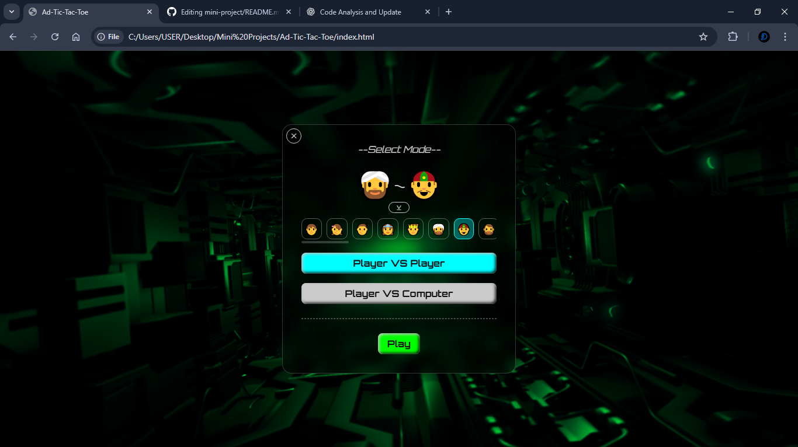
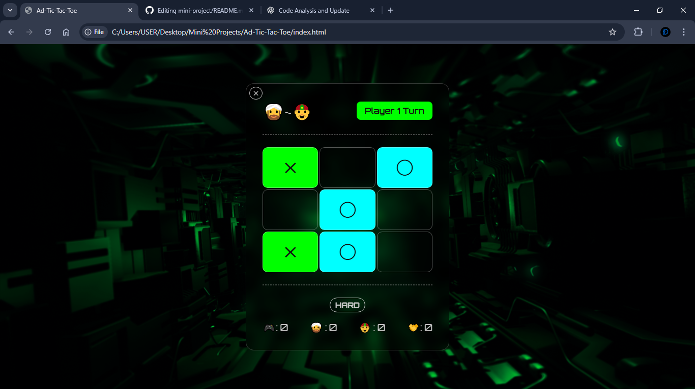
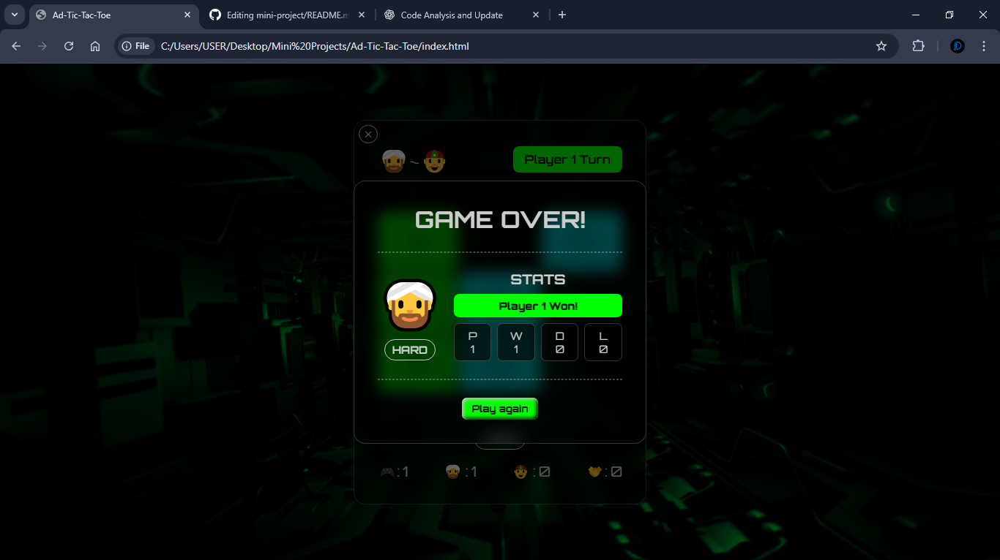

# Mini Game Project of Tic Tac Toe
---

## Description
A modern implementation of the classic **Tic Tac Toe** game built with **HTML, CSS, and JavaScript**.
This project features customizable avatars, multiple difficulty levels, and an AI opponent powered by the **Minimax algorithm** for unbeatable gameplay on Hard mode.

---

## ✨ Features
- 🎮 **Two Game Modes**
  - ```Player vs Computer```
  - ```Player vs Player```

- 🧠 **Three Difficulty Levels**
  - ```Easy``` – Random AI moves
  - ```Medium``` – Semi-smart AI
  - ```Hard``` – Unbeatable AI (Minimax algorithm)

- 👤 **Avatar Selection**
  - Choose your own player icon before starting the game.

- 🤖 **Intelligent AI**
  - Hard difficulty uses the **Minimax algorithm** to ensure optimal moves.

- 📱 **Responsive Design**
  - Works smoothly on desktop and mobile devices.

- 🎨 **Modern UI**
  - Clean glass-style interface with smooth interactions.

---

## 🖼️ Preview
> Classic strategy. Modern gameplay.
Players take turns marking spaces in a **3×3 grid**.  
The first player to align **three symbols horizontally, vertically, or diagonally wins**.

---

## 🛠️ Technologies Used
- **HTML5** – Structure
- **CSS3** – Styling and layout
- **JavaScript (Vanilla)** – Game logic and AI

---

## 🧠 AI Difficulty System
| Difficulty | Behavior |
|------------|----------|
| Easy | Computer makes random moves |
| Medium | Computer attempts winning moves when possible |
| Hard | Computer uses **Minimax algorithm** and cannot be easily beaten |

---

## 📂 Project Structure
```
  mini-project/
  │
  ├── index.html
  ├── backgroundImage.jpg
  ├── README.md
  ├── LICENSE
  ├── advance/
  │    ├── index.html # Game layout
  │    ├── style.css # UI styling
  │    └── index.js # Game logic
  └── normal/
  │    ├── index.html # Game layout
  │    ├── style.css # UI styling
  │    └── index.js # Game logic
  └── images/
```

---

## 🚀 How to Run
1. Clone the repository
```bash
git clone https://github.com/yourusername/tic-tac-toe.git
```
2. Open the project folder
3. Run the game by opening ```index.html``` in your browser.

---

## 🎯 Future Improvements
- Possible upgrades:
  - 🏆 Scoreboard system
  - 🌐 Online multiplayer
  - 🎨 Animations using GSAP
  - 💾 Save game stats with LocalStorage
  - 📱 Progressive Web App (PWA) support
  - ⚛️ React version of the game


---

## 📜 License
This project is open-source and available under the MIT License.
⭐ If you like this project, consider starring the repository!

---

## 📸 Screenshots
<p align="center">
  
  
  
  
  
  
  
  
</p>


